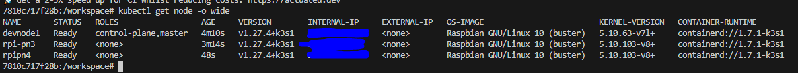

# My K3s cluster - Automated K3s setup on RaspberryPi
Kubernetes cluster setup on Raspberry Pi


## Step 1: Update your local file inventory file.
The inventory file should contain all your Raspberry Pi's hostnames, one per line. If the file contains names, use the line below to resolve to Ip addresses.

```bash
source resolve-names.bash
```
## Step 2: Use an isolated container based on Ansible as your management station
```bash
docker build --pull --rm -f "Dockerfile" -t ansiblecontainer:latest "."
```


```cmd
# Command prompt (Windows)
docker run -it --entrypoint=/bin/bash --rm -w /workspace -v %cd%:/workspace ansiblecontainer
```

```bash
# Bash
docker run -it --entrypoint=/bin/bash --rm -w /workspace -v `pwd`:/workspace ansiblecontainer
```

## Step 2: Copy SSH keys to Master and Worker nodes
The RSA key files are pointed at: ~/.ssh/id_rsa 
```bash
source copy-ssh-key.bash pi


# If above line does not work, then use command below per host:
ssh-copy-id -i ~/.ssh/id_rsa -f pi@<your_pi_host>
``` 

## Step 3: Modify the file /boot/cmdline.txt in all cluter nodes
In file /boot/cmdline.txt add cgroup_enable=cpuset cgroup_enable=memory cgroup_memory=1 into the end of the file.
Run command shown below and reboot all the Pis

```bash
source setup_kernel.bash pi
```

## Step 4: Create the Master and Node instances for the K3s cluster, passing username as an argument
```bash
source k3s-master.bash pi
source k3s-workers.bash pi
```
## Step 5: Check the installation and the cluster nodes
Saving file to: /workspace/kubeconfig

Test your cluster with:
```bash
export KUBECONFIG=/workspace/kubeconfig
kubectl config use-context default
kubectl cluster-info
kubectl get nodes -o wide
kubectl get all -A -o wide
kubectl get endpoints -A
kubectl top pod --containers -A

sudo k3s check-config  # Run this on the master server only
sudo k3s crictl ps -a # Run it on the master server
```



Yours will be different.


## Step 6: Run an Nginx cluster of 3 replicas
```bash
source k3s-nginx.bash

# Check the DNS for service is working inside the cluster
kubectl run cluster-tester -it --rm --restart=Never --image=busybox:1.28
#Or: kubectl run cluster-tester -it --rm --restart=Never --image=gcr.io/kubernetes-e2e-test-images/dnsutils:1.3
nslookup kubernetes.default
nslookup hello-svc.default.svc.cluster.local
wget -qO- hello-svc.default.svc.cluster.local
exit

# Get Checking the NGINX webpage
kubectl get nodes -o wide
```

Open your browser and navigate to:

https://<your_pi_node>

# Cleaning everything
```bash
kubectl -n k3s delete -f nginx.yaml
```


## Uninstalling Servers
To uninstall K3s from all servers and nodes, run:

```bash
source k3s-uninstall.bash
```
